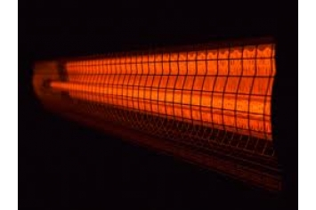

# jenis jenis persinyalan
## 1.Sinyal RF
Radio Frekuensi (RF) atau Gelombang Radio adalah tingkat osilasi dalam kisaran sekitar 3 kHz sampai 300 GHz, yang sesuai dengan frekuensi gelombang radio, dan arus bolak-balik yang membawa sinyal radio.RF merupakan unit pengukuran frekuensi gelombang, dan sesuai dengan satu siklus per detik. Gelombang elektromagnetik di daerah spektrum, dapat ditransmisikan dengan menggunakan generator arus bolak-balik yang disebabkan oleh satelit.Gelombang radio ini merupakan jenis radiasi elektromagnetik dengan panjang gelombang yang lebih besar (dan lebih jarang) dibandingkan radiasi inframerah. Seperti semua gelombang elektromagnetik lainnya bergerak dengan kecepatan cahaya dalam ruang hampa. Gelombang tersebut dapat dihasilkan secara alami oleh petir atau oleh benda-benda astronomi lainnya. Gelombang radio dapat dihasilkan untuk radio amatir, penyiaran (radio dan televisi), telepon selular, radar dan sistem navigasi lainnya, komunikasi satelit, jaringan komputer dan aplikasi lain yang tak terhitung lainnya.Gelombang elektromagnetik juga disebut gelombang radio dan dikenal sebagai frekuensi radio atau gelombang radio sederhana. Gelombang radio dapat dihasilkan arus listrik yang bervariasi dengan cepat (yaitu, frekuensi tinggi arus listrik) dalam konduktor (seperti antena).Dari sudut pandang fisika, kurang dari membuat gelombang RF tak terlihat oleh mata manusia.Frekuensi gelombang ditentukan oleh osilasi atau siklus per detik. Satu siklus adalah salah satu hertz (Hz), 1.000 siklus adalah 1 kilohertz (KHz), 1 juta siklus adalah 1 megahertz (MHz), dan 1 milyar siklus adalah 1 gigahertz (GHz). Sebuah stasiun radio pada dial / saluran AM pada 980, misalnya, siaran tersebut menggunakan sinyal yang berosilasi 980.000 kali per detik, atau memiliki frekuensi 980 KHz.Sedangkan Sebuah stasiun radio dengan di bawah dial pada 710 maka siaran tersebut menggunakan sinyal yang berosilasi 710.000 kali per detik, atau memiliki frekuensi 710 KHz.

Sinyal RF merupakan gelombang elektromagnetik yang digunakan oleh sistem komunikasi untuk mengirim informasi melalui udara dari satu titik ke titik lain. Sinyal RF telah digunakan selama beberapa tahun. Sinyal tersebut memberikan cara untuk mengirimkan musik pada radio FM dan video pada televisi. Pada kenyataannya, sinyal RF juga merupakan sarana umum untuk mengirim data melalui jaringan wireless.

# Sifat-Sifat Sinyal RF
Sinyal RF merambat di antara antena pemancar pengirim dan penerima. Seperti yang diilustrasikan Gambar 2.8, sinyal yang dipasok pada antena memiliki amplitudo, frekuensi, dan interval. Sifat-sifat tersebut berubah-ubah setiap saat untuk merepresentasikan informasi.Amplitudo mengindikasikan kekuatan sinyal. Ukuran untuk amplitudo biasanya berupa energi yang dianalogikan dengan jumlah usaha yang digunakan seseorang pada waktu mengendarai sepeda untuk mencapai jarak tertentu. Energi, dalam konteks sinyal elektromagnetik, menggambarkan jumlah energi yang diperlukan untuk mendorong sinyal pada jarak tertentu. Saat energi meningkat, jaraknya pun juga bertambah. Saat sinyal radio merambat melalui udara, sinyal tersebut kehilangan amplitudo. Jika jarak antara pengirim dan penerima bertambah, amplitudo sinyal menurun secara eksponensial. Pada lingkungan yang terbuka, di mana tidak ada rintangan, sinyal RF mengalamai apa yang disebut para engineer sebagai free-space loss yang merupakan bentuk dari pelemahan. Kondisi tersebut menyebabkan sinyal yang telah dimodulasi melemah secara eksponensial saat sinyal merambat semakin jauh dari antena. Oleh karena itu, sinyal harus memiliki cukup energi untuk mencapai jarak di mana tingkat sinyal bisa diterima sesuai yang dibutuhkan receiver. Kemampuan receiver dalam menerima sinyal tergantung pada kehadiran sinyal-sinyal RF lain yang berada di dekatnya. Frekuensi menyatakan beberapa kali sinyal berulang setiap detiknya. Satuan frekuensi adalah Hertz (Hz) yang merupakan jumlah siklus yang muncul setiap detik. Sebagai contoh, LAN nirkabel 802.11 beroperasi pada frekuensi 2,4 GHz yang berarti mencakup 2.400.000.000 siklus per detik. Interval berkaitan dengan seberapa jauh suatu sinyal tetap konstan pada titik acuan.
## 2.Infrared

Inframerah adalah radiasi elektromagnetik dari panjang gelombang lebih panjang dari cahaya tampak, tetapi lebih pendek dari radiasi gelombang radio. Namanya berarti “bawah merah” (dari bahasa Latin infra, “bawah”), merah merupakan warna dari cahaya tampak dengan gelombang terpanjang. Radiasi inframerah memiliki jangkauan tiga “order” dan memiliki panjang gelombang antara 700 nm dan 1 mm. Inframerah ditemukan secara tidak sengaja oleh Sir William Herschell, astronom kerajaan Inggris ketika ia sedang mengadakan penelitian mencari bahan penyaring optis yang akan digunakan untuk mengurangi kecerahan gambar matahari pada teleskop tata surya.
# Karakteristik
>1.tidak dapat dilihat oleh penglihatan manusia.
2.tidak dapat menembus materi yang tidak tembus pandang.
3.dapat ditimbulkan oleh komponen yang menghasilkan panas.
4.Panjang gelombang pada inframerah memiliki hubungan yang berlawanan atau berbanding terbalik dengan suhu. Ketika suhu mengalami kenaikan, maka panjang gelombang mengalami penurunan.
# Jenis-Jenis Inframerah Berdasarkan Panjang Gelombang
>1.Inframerah jarak dekat dengan panjang gelombang 0.75 – 1.5 µm.
2.Inframerah jarak menengah dengan panjang gelombang 1.50 – 10 µm.
3.Inframerah jarak jauh dengan panjang gelombang 10 – 100 µm.
## 3.Bluetooth

Bluetooth merupakan sebuah teknologi berjenis wireless atau nirkabel. Teknologi ini dikembangkan oleh BSIG atau Bluetooth Special Interest Group. Bluetooth berguna untuk memindahkan data dari satu perangkat ke perangkat lainnya tanpa memerlukan kabel. Jarak yang diperlukan Bluetooth untuk dapat berkomunikasi antar perangkat yaitu antara 1 hingga 100 meter.Sebuah perangkat Bluetooth dapat terhubung hingga ke tujuh perangkat. Saat ini teknologi Bluetooth telah dibenamkan dalam banyak perangkat elektronik, seperti smartphone, laptop, headphone, dan lain-lain. Pada smartphone misalnya, fitur Bluetooth memungkinkan kita untuk mengirimkan file berupa gambar, video, musik, dan lainnya.
