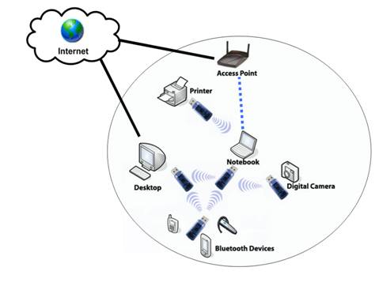
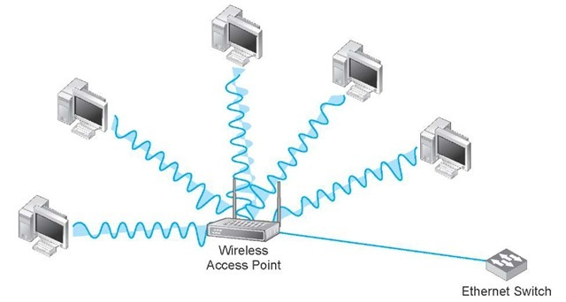
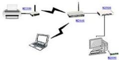
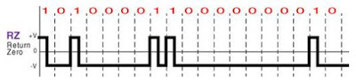
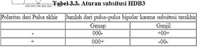

# jenis jenis persinyalan
## 1.Sinyal RF
Radio Frekuensi (RF) atau Gelombang Radio adalah tingkat osilasi dalam kisaran sekitar 3 kHz sampai 300 GHz, yang sesuai dengan frekuensi gelombang radio, dan arus bolak-balik yang membawa sinyal radio.RF merupakan unit pengukuran frekuensi gelombang, dan sesuai dengan satu siklus per detik. Gelombang elektromagnetik di daerah spektrum, dapat ditransmisikan dengan menggunakan generator arus bolak-balik yang disebabkan oleh satelit.Gelombang radio ini merupakan jenis radiasi elektromagnetik dengan panjang gelombang yang lebih besar (dan lebih jarang) dibandingkan radiasi inframerah. Seperti semua gelombang elektromagnetik lainnya bergerak dengan kecepatan cahaya dalam ruang hampa. Gelombang tersebut dapat dihasilkan secara alami oleh petir atau oleh benda-benda astronomi lainnya. Gelombang radio dapat dihasilkan untuk radio amatir, penyiaran (radio dan televisi), telepon selular, radar dan sistem navigasi lainnya, komunikasi satelit, jaringan komputer dan aplikasi lain yang tak terhitung lainnya.Gelombang elektromagnetik juga disebut gelombang radio dan dikenal sebagai frekuensi radio atau gelombang radio sederhana. Gelombang radio dapat dihasilkan arus listrik yang bervariasi dengan cepat (yaitu, frekuensi tinggi arus listrik) dalam konduktor (seperti antena).Dari sudut pandang fisika, kurang dari membuat gelombang RF tak terlihat oleh mata manusia.Frekuensi gelombang ditentukan oleh osilasi atau siklus per detik. Satu siklus adalah salah satu hertz (Hz), 1.000 siklus adalah 1 kilohertz (KHz), 1 juta siklus adalah 1 megahertz (MHz), dan 1 milyar siklus adalah 1 gigahertz (GHz). Sebuah stasiun radio pada dial / saluran AM pada 980, misalnya, siaran tersebut menggunakan sinyal yang berosilasi 980.000 kali per detik, atau memiliki frekuensi 980 KHz.Sedangkan Sebuah stasiun radio dengan di bawah dial pada 710 maka siaran tersebut menggunakan sinyal yang berosilasi 710.000 kali per detik, atau memiliki frekuensi 710 KHz.

Sinyal RF merupakan gelombang elektromagnetik yang digunakan oleh sistem komunikasi untuk mengirim informasi melalui udara dari satu titik ke titik lain. Sinyal RF telah digunakan selama beberapa tahun. Sinyal tersebut memberikan cara untuk mengirimkan musik pada radio FM dan video pada televisi. Pada kenyataannya, sinyal RF juga merupakan sarana umum untuk mengirim data melalui jaringan wireless.

# Sifat-Sifat Sinyal RF
Sinyal RF merambat di antara antena pemancar pengirim dan penerima. Seperti yang diilustrasikan Gambar 2.8, sinyal yang dipasok pada antena memiliki amplitudo, frekuensi, dan interval. Sifat-sifat tersebut berubah-ubah setiap saat untuk merepresentasikan informasi.Amplitudo mengindikasikan kekuatan sinyal. Ukuran untuk amplitudo biasanya berupa energi yang dianalogikan dengan jumlah usaha yang digunakan seseorang pada waktu mengendarai sepeda untuk mencapai jarak tertentu. Energi, dalam konteks sinyal elektromagnetik, menggambarkan jumlah energi yang diperlukan untuk mendorong sinyal pada jarak tertentu. Saat energi meningkat, jaraknya pun juga bertambah. Saat sinyal radio merambat melalui udara, sinyal tersebut kehilangan amplitudo. Jika jarak antara pengirim dan penerima bertambah, amplitudo sinyal menurun secara eksponensial. Pada lingkungan yang terbuka, di mana tidak ada rintangan, sinyal RF mengalamai apa yang disebut para engineer sebagai free-space loss yang merupakan bentuk dari pelemahan. Kondisi tersebut menyebabkan sinyal yang telah dimodulasi melemah secara eksponensial saat sinyal merambat semakin jauh dari antena. Oleh karena itu, sinyal harus memiliki cukup energi untuk mencapai jarak di mana tingkat sinyal bisa diterima sesuai yang dibutuhkan receiver. Kemampuan receiver dalam menerima sinyal tergantung pada kehadiran sinyal-sinyal RF lain yang berada di dekatnya. Frekuensi menyatakan beberapa kali sinyal berulang setiap detiknya. Satuan frekuensi adalah Hertz (Hz) yang merupakan jumlah siklus yang muncul setiap detik. Sebagai contoh, LAN nirkabel 802.11 beroperasi pada frekuensi 2,4 GHz yang berarti mencakup 2.400.000.000 siklus per detik. Interval berkaitan dengan seberapa jauh suatu sinyal tetap konstan pada titik acuan.
## 2.Infrared

Inframerah adalah radiasi elektromagnetik dari panjang gelombang lebih panjang dari cahaya tampak, tetapi lebih pendek dari radiasi gelombang radio. Namanya berarti “bawah merah” (dari bahasa Latin infra, “bawah”), merah merupakan warna dari cahaya tampak dengan gelombang terpanjang. Radiasi inframerah memiliki jangkauan tiga “order” dan memiliki panjang gelombang antara 700 nm dan 1 mm. Inframerah ditemukan secara tidak sengaja oleh Sir William Herschell, astronom kerajaan Inggris ketika ia sedang mengadakan penelitian mencari bahan penyaring optis yang akan digunakan untuk mengurangi kecerahan gambar matahari pada teleskop tata surya.
# Karakteristik
1.tidak dapat dilihat oleh penglihatan manusia.

2.tidak dapat menembus materi yang tidak tembus pandang.

3.dapat ditimbulkan oleh komponen yang menghasilkan panas.

4.Panjang gelombang pada inframerah memiliki hubungan yang berlawanan atau berbanding terbalik dengan suhu. Ketika suhu mengalami kenaikan, maka panjang gelombang mengalami penurunan.
# Jenis-Jenis Inframerah Berdasarkan Panjang Gelombang

1.Inframerah jarak dekat dengan panjang gelombang 0.75 – 1.5 µm.

2.Inframerah jarak menengah dengan panjang gelombang 1.50 – 10 µm.

3.Inframerah jarak jauh dengan panjang gelombang 10 – 100 µm.
## 3.Bluetooth

Bluetooth merupakan sebuah teknologi berjenis wireless atau nirkabel. Teknologi ini dikembangkan oleh BSIG atau Bluetooth Special Interest Group. Bluetooth berguna untuk memindahkan data dari satu perangkat ke perangkat lainnya tanpa memerlukan kabel. Jarak yang diperlukan Bluetooth untuk dapat berkomunikasi antar perangkat yaitu antara 1 hingga 100 meter.Sebuah perangkat Bluetooth dapat terhubung hingga ke tujuh perangkat. Saat ini teknologi Bluetooth telah dibenamkan dalam banyak perangkat elektronik, seperti smartphone, laptop, headphone, dan lain-lain. Pada smartphone misalnya, fitur Bluetooth memungkinkan kita untuk mengirimkan file berupa gambar, video, musik, dan lainnya.
## 4.Wifi
Wi-Fi (/ˈwaɪfaɪ/, juga ditulis Wifi atau WiFi) adalah sebuah teknologi yang memanfaatkan peralatan elektronik untuk bertukar data secara nirkabel (menggunakan gelombang radio) melalui sebuah jaringan komputer, termasuk koneksi Internet berkecepatan tinggi. Wi-Fi Alliance mendefinisikan Wi-Fi sebagai “produk jaringan area lokal nirkabel (WLAN) apapun yang didasarkan pada standar Institute of Electrical and Electronics Engineers (IEEE) 802.11”.[1] Meski begitu, karena kebanyakan WLAN zaman sekarang didasarkan pada standar tersebut, istilah “Wi-Fi” dipakai dalam bahasa Inggris umum sebagai sinonim “WLAN”.Sebuah alat yang dapat memakai Wi-Fi (seperti komputer pribadi, konsol permainan video, telepon pintar, tablet, atau pemutar audio digital) dapat terhubung dengan sumber jaringan seperti Internet melalui sebuah titik akses jaringan nirkabel. Titik akses (atau hotspot) seperti itu mempunyai jangkauan sekitar 20 meter (65 kaki) di dalam ruangan dan lebih luas lagi di luar ruangan. Cakupan hotspot dapat mencakup wilayah seluas kamar dengan dinding yang memblokir gelombang radio atau beberapa mil persegi — ini bisa dilakukan dengan memakai beberapa titik akses yang saling tumpang tindih.
# Jenis-Jenis Sinyal WiFi
Teknologi wireless (nirkabel) adalah sebuah teknologi pengembangan dari jaringan komputer yang sebelumnya menggunakan kabel sebagai media penghubungnya. wireless memanfaatkan udara/gelombang elektromagnetik sebagai media lalu lintas pertukaran datanya.Sampai saat ini, teknologi jaringan wireless yang bekerja pada frekuensi 2.4 GHz, dan/atau 5GHz berkembang pesat sekali terutama karena pembebasan izin frekuensi di band Industrial Scientific Medical (ISM) maupun band Unlicensed National Information Infrastructure.
## 1. Wireless Personal Area Network (WPAN)

WPAN (Wireless Personal Area Network) adalah sebuah bentuk komunikasi wireless yang terbatas hanya pada jarak pendek dan umumnya hanya terbatas untuk dua buah perangkat elektronik (Afriana, L. 2013. Implementasi Dan Analisis Kinerja Routing Protocol B.A.T.M.A.N-Adv (Better Approach To Mobile Ad-Hoc Networking Advanced) Pada Jaringan Berbasis Wireless Mesh. Skripsi. Universitas Indonesia.). Media yang biasa digunakan untuk WPAN antara lain :

a.Radio Frequency (RF)

b.Infra Red (IR)

c.Bluetooth
## 2.Wireless Local Area Network (WLAN)

WLAN (Wireless Local Area Network) adalah sebuah bentuk komunikasi nirkabel yang memiliki area terbatas seperti dalam suatu ruangan ataupun sebuah gedung[Afriana, L. 2013. Implementasi Dan Analisis Kinerja Routing Protocol B.A.T.M.A.N-Adv (Better Approach To Mobile Ad-Hoc Networking Advanced) Pada Jaringan Berbasis Wireless Mesh. Skripsi. Universitas Indonesia.]. WLAN memiliki standar komunikasi yang diatur oleh sebuah lembaga. Standar komunikasi data yang digunakan dalam WLAN umumnya adalah keluarga Institute of Electrical and Electronics Engineers (IEEE) 802.11.

a.IEEE 802.11a bekerja pada frekuensi 5GHz dan mempunyai kecepatan maksimum 54 Mbps.

b.IEEE 802.11b bekerja pada frekuensi 2,4GHz dan mempunyai kecepatan sampai dengan 11Mbps.

c.IEEE 802.11g bekerja pada frekuensi yang sama dengan IEEE 802.11b yaitu 2,4GHz, namun memiliki kecepatan maksimal yang lebih besar, yaitu 54Mbps.

d.IEEE 802.11n yang bekerja pada dua frekuensi yaitu 2,4 dan 5GHz dengan kecepatan maksimum adalah 100 sampai dengan 210 Mbps

IEEE sendiri adalah sebuah lembaga internasional yang bersifat non-profit yang mempromosikan pengembangan berbagai teknologi yang berkaitan dengan listrik, telekomunikasi dan jaringan komputer. IEEE menentukan berbagai standar yang sering kali dipakai sebagai standar internasional.
## 3.Ad-Hoc Mode

Toplogi Ad-hoc adalah topologi dimana 2 buah komputer dihubungkan dengan langsung menggunakan wireless adapternya.Ad-Hoc mode mirip dengan jaringan peer to peer pada jaringan kabel
## 4.Mode Infrastruktur

Topologi mode infrastruktur adalah topologi dimana access point merupakan media penghubung semua host dan terpusat pada accesspoint.Mode infrastruktur mirip dengan jaringan Client server pada jaringan LAN,idealnya 1 Accesspoint bias melayani sampai 24 client,jika lebih dari 24 akan mengganggu kestabilan koneksi wireless.
# -Ketinggian Wifi
Abstrak Wireless LAN memberikan alternatif baru dalam mengakses internet kecepatan tinggi tanpa bergantung pada jaringan kabel yang menyebabkan mobilitas user terbatas. User dapat terhubung dalam jaringan untuk mengakses dan mengirim data serta melakukan koneksi ke internet tanpa menggunakan media kabel. Untuk memperluas jangkauan sinyal yang dihasilkan Access Point (AP) tanpa menggunakan kabel, dibutuhkan sebuah Wireless Distribution System (WDS) yang mampu mendistribusikan sinyal dari satu AP ke AP yang lain. Salah satu permasalahan dalam WDS adalah penempatan posisi AP yang kurang optimal, oleh karena itu diperlukan optimasi ketinggian AP dengan mengukur kualitas layanan data agar diperoleh analisa teoritis sebelum mengimplementasikan AP. Pada penelitian ini kualitas layanan data yang diukur adalah throughput dan delay. Perancangan meliputi konfigurasi WDS dan FTP server. Pengujian dilakukan di dalam ruangan (Laboratorium KPS) dan luar ruangan (Lapangan dan Selasar) dengan variasi ketinggian AP 0,75 meter, 2 meter, 3,5 meter dan 4 meter. Ketinggian optimal AP di dalam ruangan yaitu pada ketinggian 2 meter dengan throughput rata-rata sebesar 169,08 Bps, sedangkan posisi optimal AP di luar ruangan yaitu pada ketinggian 0,75 meter dengan throughput 676,03 Bps di Lapangan Basket dan pada ketinggian 2 meter di Selasar dengan throughput rata-rata 703,7 Bps.
# -Contoh
Teknologi nirkabel memiliki beberapa contoh penggunaan,mulai dari jarak komunikasi,jangkauan data dan jenis perangkat yang digunakan.Berikut ini adalah berbagai contoh penggunaan teknologi nirkabel.

1.Siaran Radio dan Televisi

2.Komunikasi Radar

3.Komunikasi satelit

4.Wifi

5.Bluetooth

6.Identifikasi frekuensi radio
# Encoding
Encoding adalah penyandian atau proses untuk mengubah sinyal asal, ke dalam bentuk yang lebih otpimal untuk keperluan komunikasi data dan penyimpanan data. Misalnya satu byte data terdiri dari 8 bit jajar. Untuk mengirimkan data bit jajar ini memerlukan 8 saluran kanal pengirim dan 8 saluran kanal penerima. Karena ini tidak efisien, maka informasi harus di encoding atau disandikan kedalam bentuk data deret sehingga kita bisa mengirim sinyal hanya dengan satu kanal pengirim dan satu kanal penerima.Decoding adalah mengekstrak data yang telah di encoding tadi ke dalam bentuk sinyal asli atau asalnya.Dalam hal ini sebagai contoh mengubah sinyal bit deret menjadi sinyal bit data jajar.Sama juga untuk menyimpan data kedalam harddisk, harus di encoding dalam bentuk data deret. Tanpa encoding, diperlukan 8 harddisk yang bekerja sinkron yang mana itu mustahil.Tapi kalau untuk video, biasanya encoding itu mengecilkan atau mencompresi file dan decoding itu mengekstrak kedalam bentuk file asalnya.
# Teknik-Teknik Encoding
1. Non-Return to Zero (NRZ) *Karakter = saat bernilai 0 artinya tidak ada transisi sinyal (Low Signal),saat bernilai 1 artinya ada transisi (High Signal). *Jadi, pada saat bit “0” dinyatakan sebagai signal level nol, sedangkan pada saat bit “1” dinyatakan sebagai setengah periode bit pertamanya adalah high signal dan setengah periode bit keduanya adalah low signal

## 1.Non-Return to Zero
1.1. Non-Return to Zero - Level (NRZ - L) Disini tegangan ngeatif yang dipakai untuk mewakili suatu binary dan tegangan positif dipakai untuk mewakili binary lainnya.

1.2. Non-Return to Zero - Inverted (NRZ - Inverted) Suatu kode dimana suatu transisi (low ke high atau high ke low) pada awal suatu bit time akan dikenal sebagai binary ‘1′ untuk bit time tersebut; tidak ada transisi berarti binary ‘0′.
## 2. Multilevel Binary
2.1. Bipolar - AMI Suatu kode dimana binary ‘0′ diwakili dengan tidak adanya line sinyal dan binary ‘1′ diwakili oleh suatu pulsa positif atau negatif.Zero menggambarkan tidak adanya signal. Satu menggambarkan positif atau negatif sinyal.

2.2. Pseudoternary Suatu kode dimana binary ‘1′ diwakili oleh ketiadaan line sinyal dan binary ‘0′ oleh pergantian pulsa-pulsa positif dan negatif.Satu menggambarkan adanya jalur sinyal.Zero menggambarkan perwakilan dari positif dan negatif.
## 3.Biphase
3.1. Manchester Suatu kode dimana ada suatu transisi pada setengah dari periode. Tiap bit transisi ke high mewakili ‘1′ dan high ke low mewakili ‘0′.Zero dari tinggi ke rendah di pertengahan interval. Satu dari rendah ke tinggi di pertengahan interval

3.2. Diferensiasi Manchester Suatu kode dimana binary ‘0′ diwakili oleh adanya transisi di awal periode suatu bit dan binary ‘1′ diwakili oleh ketiadaan transisi di awal periode suatu bit. *Keuntungan differensial encoding: lebih kebal noise, tidak dipengaruhi oleh level tegangan. *Kelemahan dari NRZ-L atau NRZI: terbatasan dalam komponen DC dan kemampuan synchronisasi yang buruk.
## 4.Modulation Rate
Contoh : untuk kode manchester, maksimum modulation rate = 2 / tB. Salah satu cara menyatakan modulation rate yaitu dengan menentukan rata-rata jumlah transisi yang terjadi per bit time.
## 5.Scrambling Technique
Teknik biphase memerlukan kecepatan pensinyalan yang tinggi relatif terhadap data rate sehingga lebih mahal pada aplikasi jarak jauh sehingga digunakan teknik scrambling dimana serangkaian level tegangan yang tetap pada line digantikan dengan serangkaian pengisi yang akan melengkapi transisi yang cukup untuk clock receiver mempertahankan synchronisasi.
## 6.Bipolar with 8-Zeros Substitution (B8ZS)
Suatu kode dimana :

A. Jika terjadi oktaf dari semua nol dan pulsa tegangan terakhir yang mendahului oktaf ini adalah positif, maka 8 nol dari oktaf tersebut di-encode sebagai 000+-0- +

B. Jika terjadi oktaf dari semua nol dan pulsa tegangan terakhir yang mendahului oktaf ini adalah negatif, maka 8 nol dari oktaf tersebut di-encode sebagai 000-+0+ -

## 7.High-Density Bipolar - 3 Zeros (HDB3)
Suatu kode dimana menggantikan string-string dari 4 nol dengan rangkaian yang mengandung satu atau dua pulsa atau disebut kode violation, jika violation terakhir positive maka violation ini pasti negative dan sebaliknya.

Kedua kode ini berdasarkan pada penggunaan AMI encoding dan cocok untuk transmisi dengan data rate tinggi.
